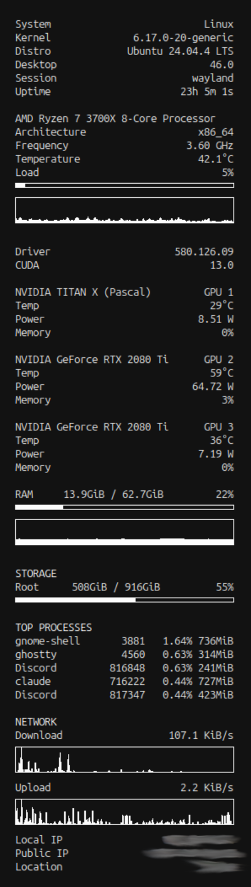

# conky-config

A clean, minimalist conky config for Ubuntu/GNOME — system stats in the
top-right corner of your desktop: CPU, GPU(s), RAM, storage, top processes,
and network throughput.

Three variants are included:

    conkyrc             multi-GPU (3x NVIDIA)
    conkyrc.single-gpu  single NVIDIA GPU
    conkyrc.minimal     no GPU section at all

> 

## Dependencies

    sudo apt install conky-all lm-sensors curl fonts-ubuntu

    # For the NVIDIA variants, you also need nvidia-smi (already bundled
    # with the proprietary NVIDIA drivers). Verify with:
    nvidia-smi --version

    # One-time sensors setup (press Enter through the prompts):
    sudo sensors-detect

## Install

Pick the variant that matches your rig and drop it at `~/.conkyrc`:

    # Multi-GPU
    cp conkyrc ~/.conkyrc

    # Single GPU
    cp conkyrc.single-gpu ~/.conkyrc

    # No GPU
    cp conkyrc.minimal ~/.conkyrc

Then launch:

    conky -d

To auto-start on login under GNOME, drop a `.desktop` entry into
`~/.config/autostart/conky.desktop`:

    [Desktop Entry]
    Type=Application
    Exec=conky -d
    Hidden=false
    NoDisplay=false
    Name=Conky

## Customisation

The file ships with my machine's values. You'll want to tweak a few things:

### 1. Network interface

Search the file for `enp41s0` and replace every occurrence with your own
interface name. Find yours with:

    ip -br link

Common names: `eno1`, `enp0s31f6`, `wlp3s0`, `wlan0`.

### 2. CPU temperature sensor

The default awk pattern matches both AMD (`Tctl`) and Intel (`Package id 0`)
labels. Run `sensors` to see what your CPU reports:

    sensors | grep -iE "tctl|package|core 0"

If you see something else (e.g. `Tdie`, `CPU`, a vendor-specific label),
adjust the pattern in the `Temperature` line of `conky.text`.

### 3. Monitor (xinerama_head)

If you have multiple monitors, set `xinerama_head` to the index of the one
you want conky displayed on (0 = primary). `xrandr` lists heads in order.

### 4. GPU count

- `conkyrc` assumes 3 NVIDIA GPUs (`--id=0`, `--id=1`, `--id=2`).
- `conkyrc.single-gpu` assumes 1.
- `conkyrc.minimal` has no GPU section.

Pick accordingly, or copy-paste / delete blocks to match your hardware.

### 5. Distro-specific lines

Two lines assume Ubuntu + GNOME:

    ${execi 86400 lsb_release -ds ...}          # needs lsb-release
    ${execi 86400 gnome-shell --version ...}    # needs GNOME

Both are wrapped in `2>/dev/null` so they silently blank out on other
systems, but you can also comment the lines out if you don't want them.

### 6. Font

Default is `Ubuntu Mono:size=10`. Install with `sudo apt install fonts-ubuntu`,
or swap the `font = ` line for `DejaVu Sans Mono`, `Fira Code`, etc.

### 7. Public IP / location

The last two lines hit `checkip.amazonaws.com` and `ipinfo.io/city` once an
hour. Harmless, but if you screenshot your desktop a lot or don't want the
outbound pings, just delete those two lines.

## Troubleshooting

- **Conky crashes instantly** — run `conky -c ~/.conkyrc` (no `-d`) in a
  terminal to see the error.
- **Temperature shows blank or "0"** — your sensor labels don't match the
  awk pattern. See "CPU temperature sensor" above.
- **Network values all zero** — wrong interface name. See `ip -br link`.
- **GPU lines blank** — `nvidia-smi` not installed or GPU index out of range.
- **Conky shows behind other windows under Wayland** — conky's `desktop`
  window type doesn't work cleanly on Wayland. Under GNOME Wayland, consider
  running an X11 session, or use a conky-alternative like `gotop`.

## License

MIT — see `LICENSE`.
